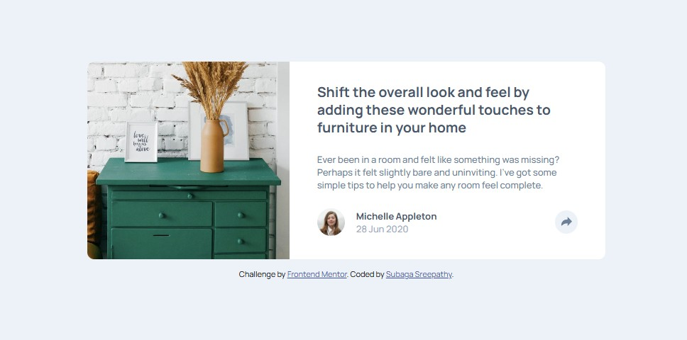

# Frontend Mentor - Article preview component solution

## Table of contents

- [Overview](#overview)
  - [The challenge](#the-challenge)
  - [Screenshot](#screenshot)
  - [Links](#links)
- [My process](#my-process)
  - [Built with](#built-with)
  - [What I learned](#what-i-learned)
  - [Continued development](#continued-development)
- [Author](#author)

## Overview

### The challenge

Users should be able to:

- View the optimal layout for the component depending on their device's screen size
- See the social media share links when they click the share icon

### Screenshot



### Links

- Solution URL: [Click here](https://www.frontendmentor.io/solutions/responsive-page-for-article-preview-component-using-html-css-and-js-BWbbhUMHmD)
- Live Site URL: [Click here](https://subagas.github.io/article-preview-component/)

## My process

### Built with

- Semantic HTML5 markup
- CSS custom properties
- Flexbox
- Mobile-first workflow
- JavaScript

### What I learned

Use this section to recap over some of your major learnings while working through this project. Writing these out and providing code samples of areas you want to highlight is a great way to reinforce your own knowledge.

To see how you can add code snippets, see below:

```html
<button class="share-icon-profile">
  <svg xmlns="http://www.w3.org/2000/svg" width="15" height="13">
    <path
      fill="#6E8098"
      d="M15 6.495L8.766.014V3.88H7.441C3.33 3.88 0 7.039 0 10.936v2.049l.589-.612C2.59 10.294 5.422 9.11 8.39 9.11h.375v3.867L15 6.495z"
    />
  </svg>
</button>
```

I used the svg tag in HTML, this made it easier to change the fill color in CSS when hovered.

```css
.profile-links {
  max-width: 19rem;
  max-height: 4.2rem;
  border-radius: 0.7rem;
  position: relative;
  left: 20.5rem;
  bottom: 11rem;
  justify-content: none;
  box-shadow: 0 0.6rem 2rem rgba(158, 175, 194, 60%);
}
.profile-links::after {
  content: ' ';
  position: absolute;
  left: 45%;
  top: 4rem;
  border: solid;
  border-color: var(--very-dark-grayish-blue) transparent transparent transparent;
  border-width: 1rem;
}
```

I styled the dailog-box for links-container in CSS using positioning and border property in CSS.

```js
function showLinks() {
  profileLinkContainer.classList.toggle('hidden');
}
```

I used `toggle()` functionality to show/hide the links-conatiner.

### Continued development

I will focus more on learning positioning property in CSS.

## Author

- Frontend Mentor - [Click here](https://www.frontendmentor.io/profile/SubagaS)
- LinkedIn - [Click here](https://www.linkedin.com/in/subaga/)
